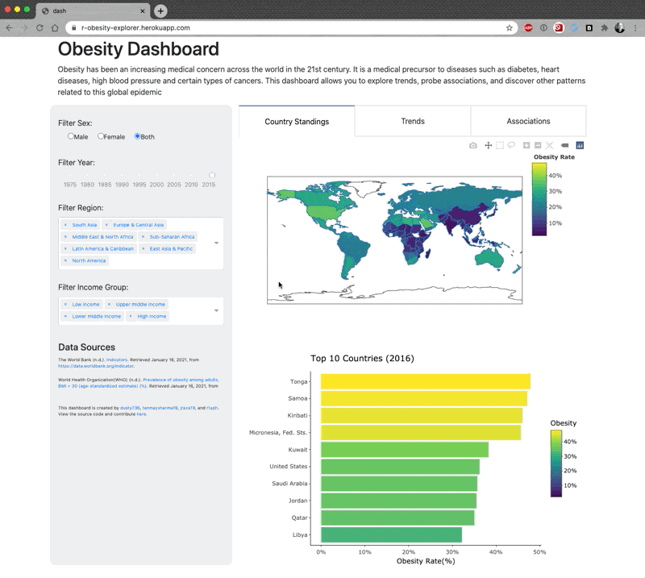

# Obesity Explorer

Group 1: Dustin Burnham, Javairia Raza, Rafael Pilliard Hellwig, Tanmay Sharma

# About

This project aims at building interactive dashboards in both Python and R
using the Dash framework. We analyze global obesity trends and try to build
visualizations that would help our target audience extract meaningful insights.
Further details can be found in our [proposal document](https://github.com/UBC-MDS/obesity-explorer/blob/main/proposal.md).

# Heroku link for the app

The dashboard app can be found at [Obesity Explorer](https://obesity-explorer.herokuapp.com/).

# Description of your app & sketch

The app’s main purpose is to educate the target audience on what countries struggle the most with obesity.  The main source of interactivity is the control panel on the left side of the dashboard.  Here there will be options to select location (dropdown), desired health outcome feature (dropdown), range of years to be viewed (slider), and aggregation features like sex (dropdown).  To show a global picture, a world map that is colored by a user-selected feature (control panel) will give a global picture of health outcomes like obesity, smoking status, poverty, etc..  Selecting a location in the control panel will highlight the country in the map and in all other applicable plots.  Below that is a horizontal bar graph that will show and highlight the top set of countries that have the highest level of some feature, like obesity rate, and give the user a sense of where the afflicted areas are.  The panel to the left of the map will show a line plot of some desired feature over the selected years.  This plot will highlight the desired country while greying out the other countries, and will show how some feature is changing over time.  Finally, the bottom left will contain plots for the top 3 features that are associated with obesity.  The relationship to obesity will be displayed as scatter plots, line plots, etc. depending on what is appropriate.

